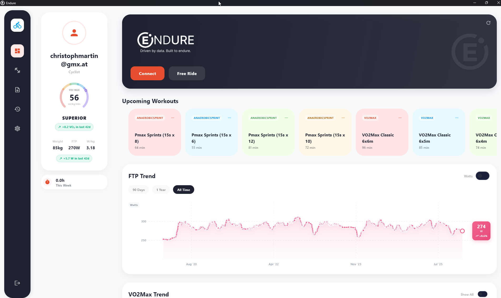

  

# ENDURE Landing Page

**🌍 Live at [www.endure-cycling.com](https://www.endure-cycling.com)**

The science-first indoor cycling analysis app for Windows.

---

---

## What is ENDURE?

ENDURE is an **indoor cycling app** that answers the real question: **"Is your training working?"**

Track FTP & VO2max trends, train with physiologically targeted workouts, and see your progress over time.

✅ **Available Now** for Windows 10/11  
🚧 **Coming Soon** to macOS, Android, iOS

---

## Contributing

Found a bug or have a feature request?

👉 **[Create an Issue on GitHub](https://github.com/cmaart/endure-website/issues)**

---

© 2026 ENDURE. All rights reserved.

